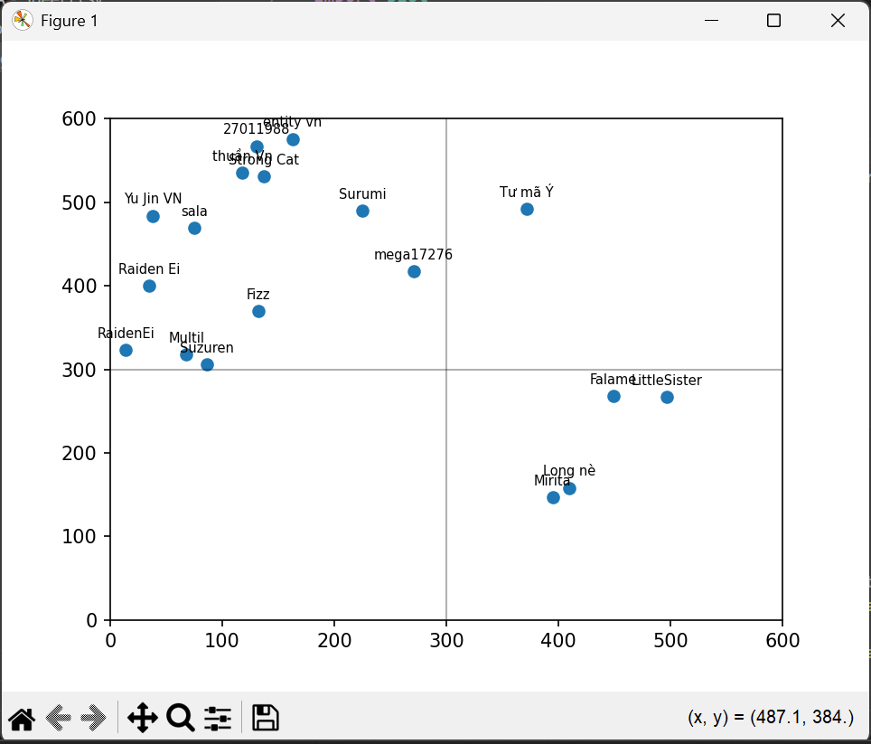
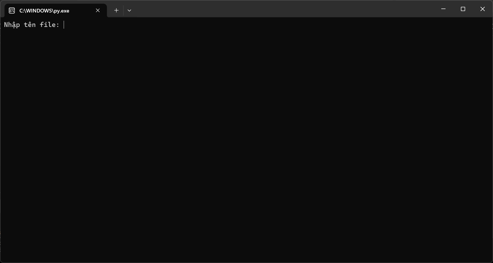

<h1>#SmartMap01<h1>
<h2>Công dụng</h1>
Tạo bản đồ cho union.

<h2>Hướng dẫn sử dụng</h2>
<h3>Bước 1</h3>

<h3>Bước 2</h3>

<h3>Bước 3</h3>
Gõ tên file (không bao gồm .csv)
<h2>Cách chuẩn bị file data<h2>
Liên hệ discord tinne123 hoặc gmail trungtin10622060@gmail.com, tại tới đây lười viết rồi.
